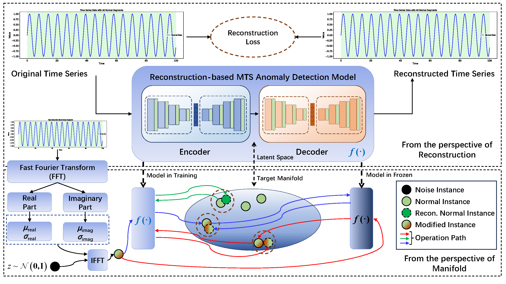

# IGAD
Idempotent reconstruction for MTS anomaly detection.

# Introduction of this work
Reconstruction-based methods are commonly choices for multivariate time series (MTS) anomaly detection. However, one challenge these methods may suffer is over generalization, where abnormal inputs are also well reconstructed. In addition, balancing robustness and sensitivity is also important for final performance, as robustness ensures accurate detection in potentially noisy data, while sensitivity enables early detection of subtle anomalies. To address these problems, inspired by idempotent generative network, we take the view from the manifold and propose a light-weight module \textbf{I}dempotent \textbf{G}eneration for \textbf{A}nomaly \textbf{D}etection (IGAD) which can be flexibly combined with a reconstruction-based method. We modify the manifold to make sure that normal time points can be mapped onto it while tightening it so that abnormal time points are dropped out with three objectives optimized simultaneously. We evaluate the proposed IGAD on methods with different structures by four real-world datasets, and they achieve a visible improvement on the F1-score, outperforming their predecessors, demonstrating the effective potential of IGAD for further improvement in MTS anomaly detection tasks.

